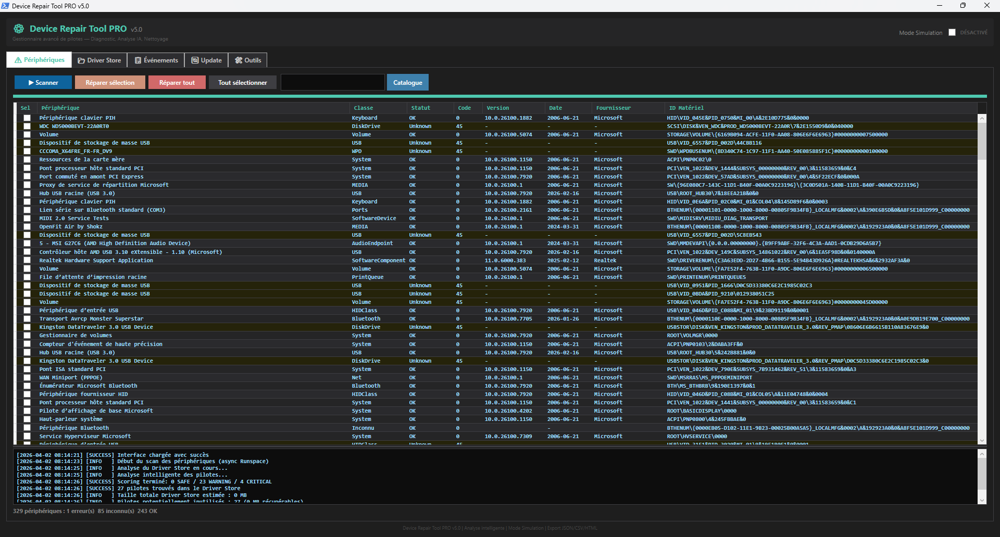
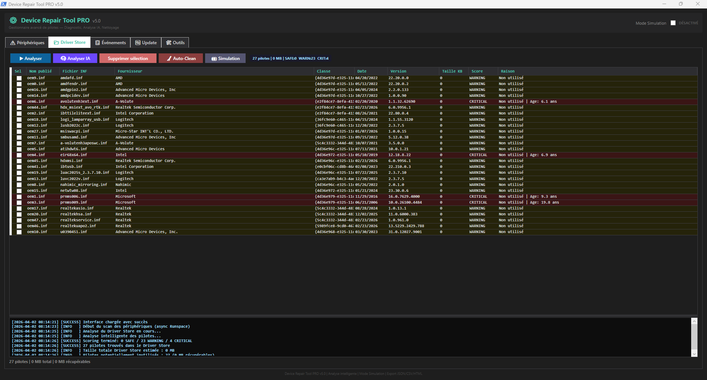
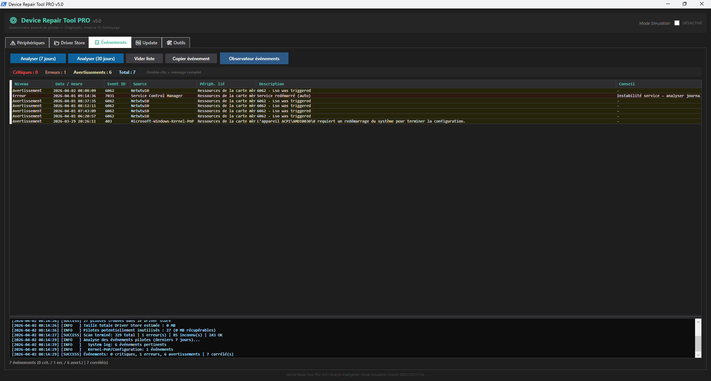
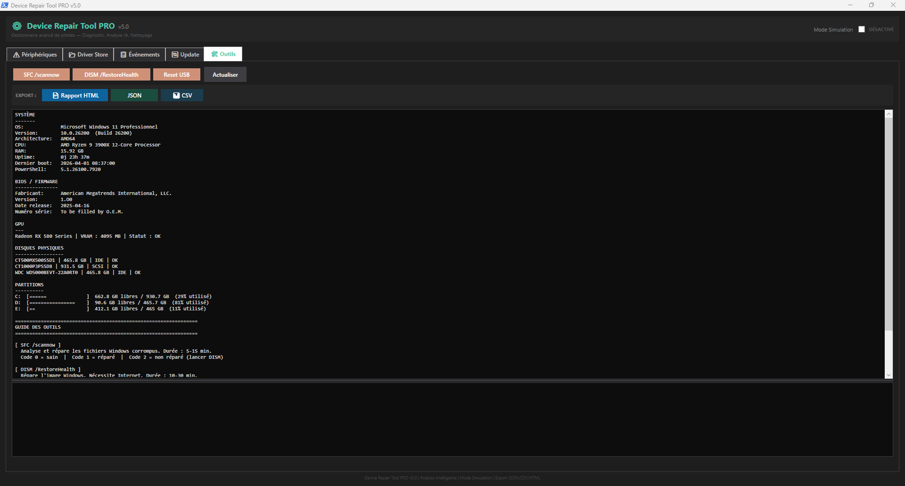

# Device Repair Tool PRO — v5.3

Outil PowerShell/WPF mono-fichier pour diagnostiquer et réparer les périphériques et pilotes PnP Windows.

**Dépôt :** https://github.com/ps81frt/driverRep  
**Dernière version :** [v5.3](https://github.com/ps81frt/driverRep/releases/tag/5.3)

---

## Table des matières

- [Aperçu](#aperçu)
- [Points clés](#points-clés)
- [Notes](#notes)
- [Exigences](#exigences)
- [Comment exécuter](#comment-exécuter)
- [Architecture](#architecture)
- [Onglets](#onglets)
  - [Onglet 1 — Analyse périphériques](#onglet-1--analyse-périphériques)
  - [Onglet 2 — Driver Store](#onglet-2--driver-store)
  - [Onglet 3 — Journal des événements](#onglet-3--journal-des-événements)
  - [Onglet 4 — Windows Update (Mises à jour de pilotes)](#onglet-4--windows-update-mises-à-jour-de-pilotes)
  - [Onglet 5 — Outils système](#onglet-5--outils-système)

---

## Aperçu

Un outil compact PowerShell/WPF qui analyse l’état des périphériques et pilotes, inspecte le Driver Store, corrèle les événements liés aux pilotes et propose des workflows de réparation pour les périphériques, les packages de pilotes et la santé du système.

## Points clés

- Script mono-fichier : `DRTPro4.ps1`
- Auto-élévation lorsque nécessaire
- Nécessite un chemin `.ps1` valide, pas d’exécution collée dans la console
- Analyse les périphériques PnP et associe les pilotes via `Win32_PnPSignedDriver`
- Parse la sortie de `pnputil /enum-drivers` avec des regex indépendantes de la langue
- Fournit un mode simulation pour prévisualiser en toute sécurité le nettoyage du Driver Store
- Inclut des commandes de réparation pour SFC, DISM, réinitialisation USB et maintenance du Driver Store

## Notes

- Exécutez via `powershell.exe -ExecutionPolicy Bypass -File DRTPro4.ps1`.
- L’outil nécessite un chemin de script et ne peut pas être collé directement dans une console interactive.
- Les droits administrateur sont demandés automatiquement si nécessaire.

---

## Exigences

| Exigence | Minimum |
|---|---|
| PowerShell | 5.3 |
| OS | Windows 10 / Windows 11 |
| Privilèges | Administrateur (auto-élévation intégrée) |
| .NET | WPF stack (`.NET Framework 4.x` — inclus avec Windows) |

Aucun module externe, aucun paquet NuGet, et pas d’accès Internet requis (sauf pour l’onglet Windows Update, qui utilise l’objet COM de l’agent Windows Update local).

---

## Comment exécuter

```powershell
powershell.exe -ExecutionPolicy Bypass -File DRTPro4.ps1
```

Si le script n’est pas lancé en tant qu’administrateur, il se relance silencieusement élevé via `Start-Process -Verb RunAs`. Si le script est lancé directement depuis une console sans chemin de fichier `.ps1`, il affiche une boîte de dialogue d’erreur et se ferme — c’est volontaire car WPF nécessite un vrai contexte de script.

La fenêtre console est immédiatement masquée après l’élévation en utilisant `kernel32!GetConsoleWindow` + `user32!ShowWindow(0)` pour que l’utilisateur ne voie que la fenêtre WPF.

---

## Architecture

Le script est structuré en sections numérotées :

1. Vérification administrateur et auto-élévation
2. Suppression de la fenêtre console via P/Invoke
3. Chargement des assemblages WPF (`PresentationFramework`, `PresentationCore`, `WindowsBase`)
4. État global script (`$Script:` variables, listes génériques typées)
5. Détection système basée CIM au démarrage (version OS, processeur, RAM)
6. Fonctions utilitaires (journalisation, échappement HTML, pause du WPF dispatcher)
7–14. Fonctions de fonctionnalités (une par onglet)
15–19. Définition de l’interface XAML et liaison des contrôles
20. Lancement de la fenêtre avec gardes d’exception imbriqués

### Modèle de thread

Tous les traitements longs utilisent le même schéma :

```
DispatcherTimer (fil UI, tick 200 ms)
    ↕ ConcurrentQueue<string>
PowerShell Runspace (fil d’arrière-plan)
```

Le runspace effectue le travail lourd, met en file des messages tagués (`[INIT]`, `[DEVICE]`, `[PROGRESS]`, `[DONE]`, `[ERR]`). Le timer vide la file sur le fil UI, met à jour les contrôles et ferme le runspace quand `[DONE]` est reçu. Cela évite le marshaling `Invoke`/`BeginInvoke` et les hacks `DoEvents`.

- **Scan périphériques** et **SFC** : runspace STA (besoin COM PnP)
- **Recherche Windows Update** : runspace MTA (besoin COM de l’agent Windows Update)
- **DISM** : sortie standard capturée en temps réel via redirection
- **SFC** : lancé dans un processus PowerShell enfant caché, puis lecture de `CBS.log` après la sortie

La capture de variables de fermeture dans les gestionnaires d’événements `.NET` est gérée explicitement — le scope `$Script:` est peu fiable dans les closures `DispatcherTimer.Tick`, donc les références de listes sont capturées dans des variables locales avant la création de la closure.

---

## Onglets

### Onglet 1 — Analyse périphériques

Interroge tous les périphériques PnP via `Get-PnpDevice` et recoupe avec `Win32_PnPSignedDriver` en utilisant une table de hachage préconstruite clé par `DeviceID` (pour éviter de filtrer plusieurs fois avec `Where-Object`, une seule passe).

Affiché par périphérique :
- Nom convivial, classe du périphérique
- Statut PnP (`OK`, `Error`, `Degraded`, `Unknown`)
- `ConfigManagerErrorCode`
- `InstanceId`
- Version du pilote, date du pilote, fournisseur

La barre de statut affiche le nombre total de périphériques avec une répartition : `N erreur(s) / N inconnu(s) / N OK`.

Après le scan, les boutons « Réparer sélectionnés » et « Réparer toutes les erreurs » ne sont activés que s’il existe des périphériques en erreur.

**Logique de réparation** (par périphérique, via `DispatcherTimer` toutes les 500 ms) :
1. `Disable-PnpDevice` → attente 500 ms → `Enable-PnpDevice`
2. Si le périphérique a un fichier INF associé : `pnputil /delete-driver <inf> /force` puis `pnputil /add-driver <inf> /install`

**Recherche catalogue :** remplit un terme de recherche à partir du périphérique sélectionné (nom convivial ou classe), ouvre `catalog.update.microsoft.com/Search.aspx?q=<term>` dans le navigateur par défaut.



---

### Onglet 2 — Driver Store

Exécute `pnputil /enum-drivers` et parse la sortie en détectant les blocs `oem\d+.inf`. Le parseur extrait les étiquettes localisées avec des regex, en traitant `provider|fournisseur`, `version`, `classe|class` et `original|origine`.

Affiché par package de pilote :
- Nom publié (`oem0.inf` … `oem999.inf`)
- Nom INF original
- Fournisseur
- Version
- Date
- Classe
- Taille estimée depuis `%SystemRoot%\System32\DriverStore\FileRepository`
- Score (`SAFE`, `WARNING`, `CRITICAL`)
- Raison du score

Les tailles de pilotes sont estimées en parcourant `%SystemRoot%\System32\DriverStore\FileRepository`, en associant chaque dossier à son nom INF et en sommant les tailles des fichiers.

La suppression de pilotes utilise `Invoke-RemoveDrivers` et `pnputil /delete-driver <oemX.inf> /force`, après vérification du nom de package `^oem\d+\.inf$` et confirmation utilisateur. La liste du Driver Store est actualisée après suppression réussie.

Une case à cocher « Mode Simulation » est disponible dans l’interface, et un bouton de prévisualisation force le mode simulation. Quand il est activé, l’outil journalise les actions `[SIM]` et l’espace estimé libéré sans exécuter de commandes `pnputil`.



---

### Onglet 3 — Journal des événements

Rassemble les événements Windows liés aux pilotes à partir de trois sources :

| Source | Filtre |
|---|---|
| `System` | Niveau 1/2/3, nom du fournisseur correspond à un regex de 30 sources de pilotes |
| `Microsoft-Windows-Kernel-PnP/Configuration` | Niveau 1/2/3 |
| `Application` | Niveau 1/2, identifiants 1000/1001/1002, fournisseur correspond à `wer\|fault\|crash` |

Le motif de fournisseur couvre : kernel-pnp, disk, volmgr, nvlddmkm, amdkmpfd, atikmdag, usbhub, USBXHCI, Netwtw, HidUsb, HDAudBus, storahci, stornvme, Wacom, Synaptics, et ~20 autres.

Un ensemble d’ID d’événements est inclus en force quel que soit le fournisseur : `9, 11, 15, 20, 43, 51, 129, 153, 157, 219, 411, 1001, 6008, 7026, 7031, 7034, 7045`.

Les événements sont dédupliqués par `(EventId | TimeCreated.Ticks | ProviderName)` en utilisant un `HashSet<string>`, triés par ordre décroissant, limités à 500 entrées.

**Base de connaissance intégrée** (17 ID) :

| ID | Description | Conseil par défaut |
|---|---|---|
| 9 | Temps d’attente du périphérique | Vérifier la connexion physique |
| 11 | Erreur du contrôleur de disque | Tester le S.M.A.R.T., vérifier câbles SATA/NVMe |
| 15 | Périphérique non prêt | Réinitialiser l’USB ou réinstaller le pilote |
| 20 | Échec d’installation du pilote | Vérifier compatibilité OS/architecture |
| 43 | Problème USB | Réinitialiser l’USB ou désactiver la suspension sélective |
| 51 | Erreur de pagination disque | Exécuter `chkdsk /r` |
| 129 | Réinitialisation du contrôleur | Mettre à jour le firmware/driver du contrôleur de stockage |
| 153 | Délai d’E/S | Le disque peut être en panne — cloner et remplacer |
| 157 | Éjection anormale du disque | Vérifier alimentation/câbles |
| 219 | Pilote non chargé | Réinstaller ou mettre à jour, vérifier signature |
| 411 | Échec d’installation du périphérique | Vérifier le Driver Store, relancer l’analyse |
| 1001 | Rapport WER | Analyser les dumps dans `%localappdata%\CrashDumps` |
| 6008 | Arrêt inattendu | Vérifier températures, RAM (memtest), PSU |
| 7026 | Échec d’un pilote de démarrage | Vérifier les services défaillants via msconfig |
| 7031 | Service redémarré automatiquement | Analyser le journal Application |
| 7034 | Service arrêté de manière inattendue | Vérifier les plantages, mettre à jour le composant |
| 7045 | Nouveau service installé | Vérifier l’origine (possible malware) |

**Corrélation avec l’onglet 1 :** si un scan a été effectué, le texte complet de chaque événement est comparé aux fragments `InstanceId` et aux noms conviviaux de tous les périphériques en erreur. Les correspondances sont affichées dans une colonne `DeviceHint`.

Plage de scan : 7 jours ou 30 jours (deux boutons).  
Double-cliquer sur une ligne ouvre une fenêtre popup avec le message complet de l’événement.  
Le bouton « Copier » place le détail complet de l’événement dans le presse-papiers.



---

### Onglet 4 — Windows Update (Mises à jour de pilotes)

Utilise l’objet COM `Microsoft.Update.Session` (requiert un appartement MTA) pour interroger les mises à jour en attente filtrées sur `Type = 2` (pilotes uniquement). S’exécute dans un runspace MTA en arrière-plan.

Affiché par mise à jour disponible :
- Titre
- Description
- Taille (MB)
- Numéro KB

L’onglet propose des boutons pour ouvrir le Catalogue Microsoft Update et `store.rg-adguard.net` dans le navigateur.

---

### Onglet 5 — Outils système

**SFC /scannow**  
Lancé dans un processus `powershell.exe` enfant caché pour obtenir un vrai code de sortie (SFC nécessite un environnement console). Après sortie, `%windir%\Logs\CBS\CBS.log` est lu (encodage Unicode), les 100 dernières lignes correspondantes à `[SR]` sont extraites, et le code de sortie est interprété :

| Code de sortie | Signification |
|---|---|
| 0 | Aucune violation d’intégrité trouvée |
| 1 | Violations trouvées et réparées |
| 2 | Violations trouvées mais non réparées — exécuter DISM d’abord |

**DISM /RestoreHealth**  
Lancé avec `RedirectStandardOutput = true`. La sortie est diffusée ligne par ligne dans la zone de journal en temps réel via le pattern queue/timer.

**Réinitialisation USB**  
Exécute `Get-PnpDevice` filtré par `InstanceId -match '^USB\\'`, en excluant les classes `HIDClass`, `Keyboard`, `Mouse`, `System`, `SecurityDevices`, `Biometric` pour éviter de perdre les périphériques d’entrée pendant le reset. Pour chaque périphérique restant : `Disable-PnpDevice` → 300 ms → `Enable-PnpDevice`.

**Infos système**  
Affiche : légende OS, architecture, nom du processeur, RAM totale (GB), version PowerShell, temps de fonctionnement (`Xd Yh Zm`), date du dernier démarrage. Actualisable.

**Export de rapport HTML**  
Génère un fichier HTML thème sombre sur le bureau (`DeviceRepairTool_Report_<timestamp>.html`). Le rapport inclut :
- navigation latérale avec ancres et badges couleur
- cartes de stats (nombre de périphériques, nombre de pilotes, nombre d’événements, nombre d’événements critiques)
- grille d’infos système
- tableau complet des périphériques en problème (onglet 1)
- tableau complet du Driver Store (onglet 2)
- tableau complet des événements (onglet 3)
- journal d’activité complet

Toutes les valeurs sont échappées HTML avant insertion. Le rapport est construit avec `StringBuilder` pour éviter des concaténations répétées. La mise en page utilise CSS grid et flexbox, en-têtes de tableau fixes et colonnes responsives.



---

## Journalisation

Chaque opération ajoute un objet `PSCustomObject` en mémoire avec les champs `Timestamp`, `Level` (`INFO` / `SUCCESS` / `WARNING` / `ERROR`), et `Message`. Chaque onglet possède une zone de texte en lecture seule qui affiche le journal formaté et défile automatiquement vers la dernière entrée. Les journaux peuvent être effacés depuis l’interface.

---

## Contraintes connues

- Nécessite un chemin de fichier `.ps1` (`$PSCommandPath` ne doit pas être null) — le script ne peut pas être collé dans une console interactive.
- L’onglet Windows Update utilise l’objet COM de l’agent Windows Update ; il ne renverra aucun résultat sur les systèmes où WUA est désactivé ou derrière WSUS avec des stratégies différentes.
- La sortie SFC est lue à partir de `CBS.log` après coup, pas diffusée en temps réel.
- La réparation de périphérique via réinstallation d’INF ne s’applique que si le périphérique dispose d’un INF renseigné dans `Win32_PnPSignedDriver` ; sinon seule la boucle disable/enable est effectuée.
- La suppression du Driver Store est irréversible. Le script valide le motif `oem\d+\.inf` avant d’appeler `pnputil /delete-driver` mais n’effectue pas de vérification de dépendance.

---

## Structure des fichiers

```
driverRep/
├── DRTPro.ps1          # Script principal (également publié sous DRTPro4.ps1 en v5.3)
├── cd-rom-driver_25179.ico
└── .gitattributes
```

L’ensemble de l’application tient dans un seul fichier `.ps1`. L’icône est une ressource annexe ; le script ne l’utilise pas à l’exécution (elle est utilisée pour le packaging de la release).